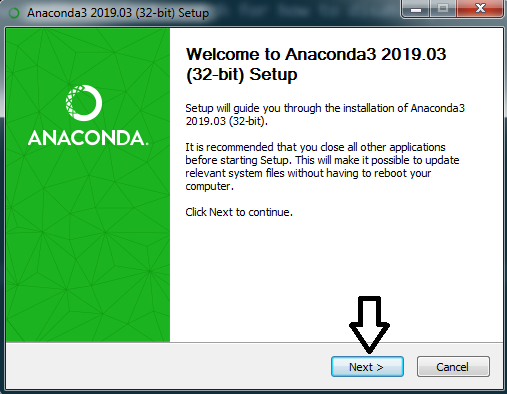
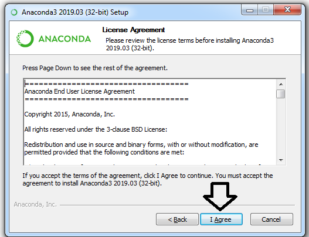
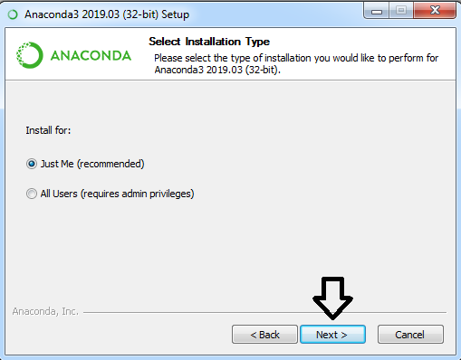
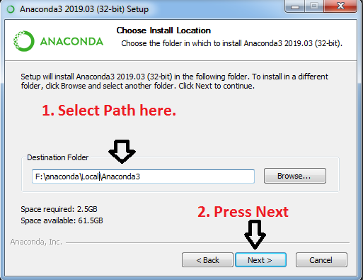
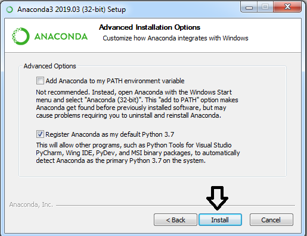
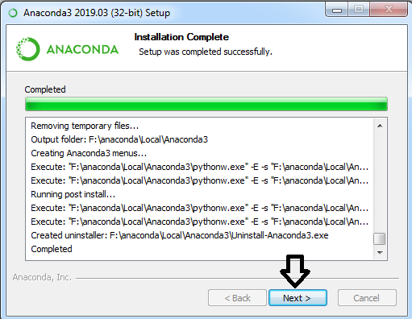
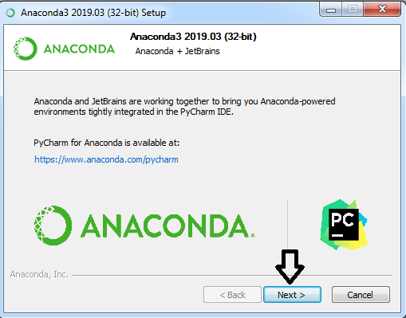

# Installing Anaconda shortest way.

### Step 1

Select for which architecture you want to install it. 

- Download anaconda 
  - [Do not know](https://repo.anaconda.com/archive/Anaconda3-2019.03-Windows-x86.exe)
  - [64bit](https://repo.anaconda.com/archive/Anaconda3-2019.03-Windows-x86_64.exe) 
  - [32bit](https://repo.anaconda.com/archive/Anaconda3-2019.03-Windows-x86.exe) 
  

### Step 2

Disable your anti-virus software Just search for how to disable your anti-virus software name on windows.

### Step 3

Double click on installer file.

### Step 4 

press **Next** [Image1](images/Image1.png)

### Step 5

Press **I Agree** [Image2](images/Image2.png)

### Step 6

Press **Next** [Image3](images/Image3.png)

### Step 7

Select path by **typing** yourself **OR** use **browse** button And Press **Next**  [Image4](images/Image4.png)

### Step 8

Press **Next** [Image5](images/Image5.png) 

### Step 9

Press **Next** [Image6](images/Image6.png)

### Step 10

Press **Next** [Image7](images/Image7.png)

### Step 11

Press **Finish** [Image8](images/Image8.png)

### Congrats Installation is complete.

# References Used
- [Google](https://google.com)
- [Official installation guide](https://docs.anaconda.com/anaconda/install/windows/)

